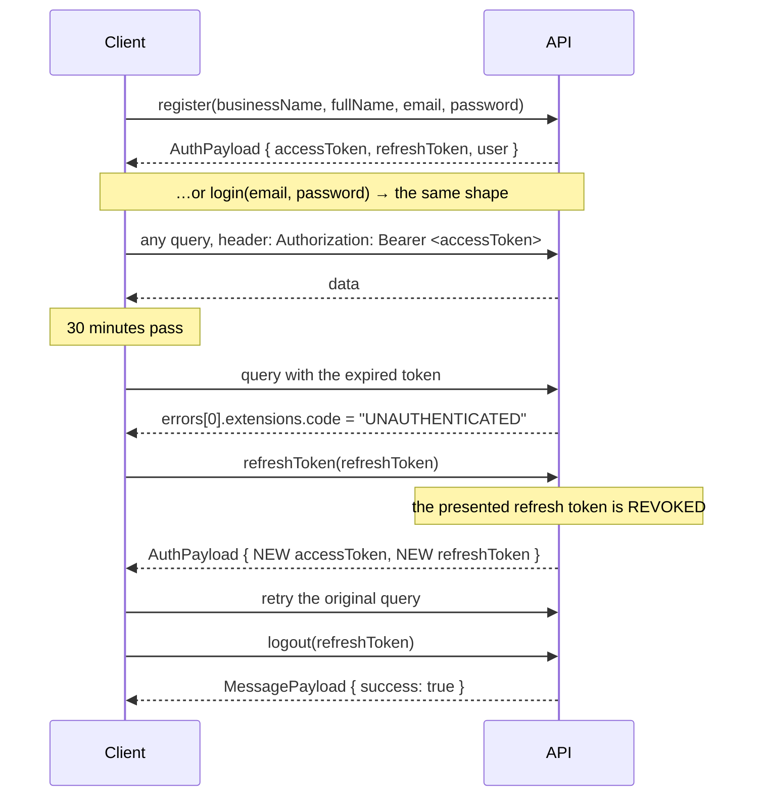

# API

The Credit Management System speaks **GraphQL** for everything except binaries, which
move over five REST routes (§9).

| | |
|---|---|
| GraphQL endpoint | `POST /graphql` |
| GraphiQL explorer | `GET /graphql` — **development only** (`DEBUG=true`) |
| Introspection | **development only.** Off in production, deliberately. |
| Health | `GET /health` |

Every example below was run against the seeded demo database and the responses are
real, not illustrative.

To dump the schema yourself:

```bash
cd backend
./.venv/bin/python -c "from app.graphql.schema import schema; print(schema.as_str())"
```

---

## 1. Money is always a string

**Read this before you write a single line of client code.**

Every money value crosses the wire as a **string with two decimal places**, in *both*
directions:

```json
{ "grandTotal": "2205.00", "remainingAmount": "1205.00" }
```

```graphql
recordPayment(input: { creditId: "…", amount: "1000.00" })
```

`"1000"`, `"1000.5"` and `"1000.50"` are all accepted on input. Output is always
normalised to `"1000.50"`.

**Why.** JSON numbers are IEEE-754 doubles. A client sending `1234567.89` hands the
server `1234567.8899999999`, and the customer's balance is wrong by a cent — forever.
`0.1 + 0.2 !== 0.3` in every JavaScript runtime on earth. So the API refuses to have
that conversation: **text on the wire, `Decimal` in the process, integer minor units in
the database.** (`app/graphql/inputs.py`, `app/models/types.py`,
[ARCHITECTURE.md §4](ARCHITECTURE.md).)

**The consequence for you:** do not do arithmetic on these values with `Number()` or
`parseFloat`. Format them for display, or use `decimal.js` / `big.js` if you must
compute. `NaN` and `Infinity` are rejected at the boundary with a `VALIDATION_ERROR`.

This applies to `quantity`, `taxPercentage`, `discountPercentage` and `stockQuantity`
too — everything numeric that must not drift.

---

## 2. Authentication

### The flow



| | Lifetime | Where it lives |
|---|---|---|
| `accessToken` | **30 min** (`ACCESS_TOKEN_EXPIRE_MINUTES`) | Send as `Authorization: Bearer <token>` on every request. The reference client keeps it **in memory only**. |
| `refreshToken` | **30 days** (`REFRESH_TOKEN_EXPIRE_DAYS`) | Exchange it for a new pair when the access token expires. |

### Refresh-token rotation

`refreshToken(refreshToken:)` **revokes the token you presented** and issues a brand-new
pair. The old one is dead the moment you use it.

Two things follow, and you must handle both:

- **A refresh token is single-use.** Replaying one — or presenting one you already
  rotated away — returns `UNAUTHENTICATED` with *"Session is no longer valid. Please
  sign in again."* This is not a bug; it is the point. A stolen token is usable at most
  once, and the legitimate user's next refresh then fails — which is a **detectable
  compromise**.
- **Concurrent refreshes race.** If five queries 401 at once and you fire five refreshes,
  four of them are replaying a token the first one revoked, and they all fail. Serialise
  them: keep **one in-flight refresh promise** and let every waiter await it. The
  reference implementation is `frontend/src/lib/graphql/client.ts`.

Server-side, only a **SHA-256 digest** of each refresh token is stored, so a database
leak yields nothing replayable — and revocation is real (logout, password change, admin
kill). A password reset or change revokes **every** live session.

### Permissions

`me { permissions }` returns the caller's flat permission list — `"credit:write"`,
`"payment:delete"`, and so on. Use it to decide what to *render*. **The server
authorises for real**; the client list is a UX affordance, not a security control.

Roles are `SUPER_ADMIN`, `ADMIN`, `STAFF`. The matrix is in
[ARCHITECTURE.md §11](ARCHITECTURE.md).

### Tenancy

You never pass a `businessId`. It comes from your token. An `ADMIN` or `STAFF` user is
pinned to their own business; a `SUPER_ADMIN` is the only role that may cross the
boundary. **Asking for another tenant's record by id returns `NOT_FOUND`, not
`FORBIDDEN`** — "that exists but isn't yours" would confirm the existence of another
tenant's data.

---

## 3. Conventions

### Pagination

Offset-based. Every list query takes `page: PageInput` and returns a `*Page` type.

```graphql
input PageInput {
  page: Int! = 1
  limit: Int! = 25      # clamped to MAX_PAGE_SIZE (100)
}

type PageInfo {
  total: Int!           # rows matching the filter, ignoring the page window
  page: Int!
  limit: Int!
  pages: Int!
  hasNext: Boolean!
  hasPrevious: Boolean!
}
```

`limit: 1000000` is silently clamped to 100, not rejected. Page numbers below 1 are
clamped to 1.

`NotificationPage` additionally carries `unreadCount`.

### Sorting

```graphql
input SortInput {
  field: String! = "created_at"    # snake_case, from an allow-list
  desc: Boolean! = true
}
```

The field name is **allow-listed per entity** — it is never `getattr(Model, clientString)`,
which would be an injection vector even through an ORM.

| Query | Allowed `field` values | Unknown value |
|---|---|---|
| `credits` | `created_at`, `due_date`, `issued_date`, `grand_total`, `remaining_amount`, `number`, `status` | silently falls back to `created_at` |
| `payments` | `paid_at`, `amount`, `created_at`, `number` | silently falls back to `paid_at` |
| `customers` | `name`, `created_at`, `outstanding_balance`, `credit_score`, `code` | **raises `VALIDATION_ERROR`** |
| `products` | `name`, `created_at`, `price`, `stock_quantity` | **raises `VALIDATION_ERROR`** |
| `services` | `name`, `created_at`, `price` | **raises `VALIDATION_ERROR`** |

(The inconsistency is real. Credits and payments fall back; the others complain.)

### Filtering

Each list query takes a typed `*FilterInput`. All fields are optional and AND-combined.
Money bounds are strings; dates are ISO `YYYY-MM-DD`.

```graphql
input CreditFilterInput {
  search: String        # matches credit number, notes, or customer name/phone/code
  status: [CreditStatus!]
  customerId: ID
  dueFrom: Date         dueTo: Date
  issuedFrom: Date      issuedTo: Date
  minAmount: String     maxAmount: String     # on grandTotal
  overdueOnly: Boolean! = false
}
```

Archived credits (in the retention pipeline) are **excluded from every list by default**,
so the owner is not shown records they no longer need to chase.

### Scalars

| Scalar | Format |
|---|---|
| `Date` | `"2026-09-30"` |
| `DateTime` | `"2026-07-14T06:22:09.964773+00:00"` — always UTC, always tz-aware |
| `JSON` | arbitrary object (`workingHours`, `link`, `changes`) |
| money | `String` — see §1 |

---

## 4. Queries

### Identity & tenancy

| Query | Returns | Notes |
|---|---|---|
| `me` | `UserType!` | The signed-in user, with `permissions`. |
| `business` | `BusinessType!` | The caller's own business. |
| `businesses(page, search, isActive)` | `BusinessPage!` | **SUPER_ADMIN only.** |
| `users(page, search, role, isActive)` | `UserPage!` | Staff accounts in the caller's business. |

### Customers

| Query | Returns | Notes |
|---|---|---|
| `customer(id)` | `CustomerType!` | |
| `customers(filter, page, sort)` | `CustomerPage!` | Filter: `search`, `status`, `minOutstanding`, `maxOutstanding`, `hasOverdue`. |
| `customerScore(id)` | `CustomerScore!` | The 0–100 internal score **and the plain-language reasons for it**. Not a bureau score — a local heuristic over this shop's own history with this customer. |

### Catalog

| Query | Returns |
|---|---|
| `categories(search)` | `[CategoryType!]!` |
| `product(id)` / `products(filter, page, sort)` | `ProductType!` / `ProductPage!` |
| `service(id)` / `services(filter, page, sort)` | `ServiceType!` / `ServicePage!` |

`ProductFilterInput` has `lowStockOnly`. `ProductType.isLowStock` is computed.

### Credits & payments

| Query | Returns | Notes |
|---|---|---|
| `credit(id)` | `CreditType!` | |
| `creditByNumber(number)` | `CreditType!` | e.g. `"CR-2026-0042"`. |
| `credits(filter, page, sort)` | `CreditPage!` | |
| `payment(id)` | `PaymentType!` | |
| `payments(filter, page, sort)` | `PaymentPage!` | Voided payments excluded unless `includeVoided: true`. |
| `paymentHistory(creditId)` | `[PaymentType!]!` | **Voided payments INCLUDED.** The ledger is append-only; the UI strikes voids through rather than hiding them. |

### Dashboard, reports, search

| Query | Returns | Notes |
|---|---|---|
| `dashboard` | `Dashboard!` | Everything the dashboard draws, in one round trip: `summary`, `monthly`, `overdueTrend`, `topCustomers`, `latestActivity`, `upcomingDue`, `collectionsByMethod`. |
| `report(input)` | `ReportSummary!` | `period: DAILY \| WEEKLY \| MONTHLY \| YEARLY \| CUSTOM` + optional `startDate`/`endDate`. |
| `search(query, limit)` | `SearchResults!` | Global. Customers (name/phone/code), credits (number), payments (reference/number), products (name/SKU). |

### Communications

| Query | Returns |
|---|---|
| `notifications(state, page)` | `NotificationPage!` (with `unreadCount`) |
| `unreadNotificationCount` | `Int!` — a `COUNT(*)`, not a fetch |
| `emailTemplates` / `emailTemplate(kind)` | `[EmailTemplateType!]!` / `EmailTemplateType!` |
| `templateVariables(kind)` | `[TemplateVariableType!]!` — the `{{variables}}` this template kind may use, with examples |
| `reminders(status, creditId, page)` | `ReminderPage!` |

### Storage, retention, audit

| Query | Returns | Notes |
|---|---|---|
| `storageUsage` | `StorageUsage!` | Database bytes, upload bytes, a breakdown, entity counts, `bytesSavedByCompression`, quota. |
| `archiveBatches(page)` | `ArchiveBatchPage!` | With `daysUntilDeletion` and `canRestore`. |
| `retentionPreview` | `RetentionPreview!` | What the **next** sweep would archive. Moves nothing. |
| `exports(page)` / `export(id)` | `ExportJobPage!` / `ExportJobType!` | |
| `auditLogs(page, entityType, entityId)` | `AuditLogPage!` | ADMIN and above. |

---

## 5. Mutations

### Auth

| Mutation | Returns | Notes |
|---|---|---|
| `login(input: {email, password})` | `AuthPayload!` | 5 failures → account locked for 15 minutes. "Unknown email" and "wrong password" are the **same** error, deliberately. |
| `register(input: {businessName, fullName, email, password})` | `AuthPayload!` | Creates a business + its first `ADMIN`, atomically, and signs them in. Password policy: ≥ 8 chars, ≥ 1 letter, ≥ 1 digit. |
| `refreshToken(refreshToken)` | `AuthPayload!` | **Rotates.** The presented token is revoked. |
| `logout(refreshToken)` | `MessagePayload!` | Idempotent. |
| `requestPasswordReset(email)` | `MessagePayload!` | **Always reports the same thing**, registered or not — otherwise it is a free account-enumeration oracle. |
| `resetPassword(input: {token, newPassword})` | `MessagePayload!` | Single-use token. Revokes every session. |
| `changePassword(input: {currentPassword, newPassword})` | `UserType!` | Revokes every session. |

### Users & business

| Mutation | Returns | Notes |
|---|---|---|
| `updateProfile(input)` | `UserType!` | Self-service. **Cannot touch `role` or `isActive`.** |
| `updateBusiness(input)` | `BusinessType!` | Profile, reminder prefs, retention policy, branding — all in one input. |
| `createUser` / `updateUser(id)` / `deactivateUser(id)` / `deleteUser(id)` | `UserType!` | `user:manage`. |

### Customers & catalog

| Mutation | Returns | Notes |
|---|---|---|
| `createCustomer` / `updateCustomer(id)` | `CustomerType!` | |
| `deleteCustomer(id)` | `CustomerType!` | **Refused while the customer still owes money.** |
| `restoreCustomer(id)` | `CustomerType!` | Undo a soft delete. |
| `createCategory` / `updateCategory(id)` / `deleteCategory(id)` | `CategoryType!` | Deleting a category **uncategorises** its members; it does not delete them. |
| `createProduct` / `updateProduct(id)` / `deleteProduct(id)` | `ProductType!` | |
| `adjustStock(id, delta, reason)` | `ProductType!` | `delta` is a signed string. **Stock may go negative on purpose** — a stale count must never block a sale. |
| `createService` / `updateService(id)` / `deleteService(id)` | `ServiceType!` | |

### Credits & payments — the core

| Mutation | Returns | Notes |
|---|---|---|
| `createCredit(input)` | `CreditType!` | Needs ≥ 1 item. Refused for a `BLOCKED` customer. `initialPayment` records a payment at the counter in the same call. |
| `updateCredit(id, input)` | `CreditType!` | Passing `items` **replaces the whole line set**. Refused if the new total drops below what has already been paid. Cannot edit a `CANCELLED` credit. Moving `dueDate` cancels any queued reminder. |
| `cancelCredit(id, reason)` | `CreditType!` | **Refused once money has changed hands** — void the payments first. |
| `deleteCredit(id)` | `CreditType!` | **Refused if any payment exists** — cancel it instead, so the ledger survives. |
| `recordPayment(input)` | `PaymentType!` | **Overpayment is refused here, at the counter.** |
| `voidPayment(id, reason)` | `PaymentType!` | Reverses a payment **without erasing it**. `reason` is mandatory and becomes part of the permanent record. Can reopen a `PAID` credit. |

There is deliberately **no `updatePayment` and no `deletePayment`.** See
[ARCHITECTURE.md §6](ARCHITECTURE.md).

### Reminders & templates

| Mutation | Returns | Notes |
|---|---|---|
| `sendReminder(creditId)` | `ScheduledReminderType!` | **Queues** an immediate reminder. The sweep delivers it — it does not send inline. |
| `cancelReminder(id)` | `ScheduledReminderType!` | |
| `updateEmailTemplate(kind, input)` | `EmailTemplateType!` | Subject, body, footer, signature, colours, logo. |
| `resetEmailTemplate(kind)` | `EmailTemplateType!` | Restore the shipped copy, discarding the owner's edits. |
| `previewEmailTemplate(kind)` | `String!` | Rendered HTML with realistic sample data. |

### Notifications, exports, retention, storage

| Mutation | Returns | Notes |
|---|---|---|
| `markNotificationRead(id)` / `archiveNotification(id)` / `deleteNotification(id)` | | |
| `markAllNotificationsRead` | `Int!` — how many were marked | |
| `createExport(input: {format, datasets, dateFrom, dateTo})` | `ExportJobType!` | Runs **synchronously** and returns the `READY` (or `FAILED`) job. `format`: `CSV \| XLSX \| JSON \| PDF`. `datasets`: any of `customers`, `credits`, `payments`, `products`, `services`, `business`, `reports`. The file **expires after 24 hours** (`EXPORT_TTL_HOURS`). |
| `postponeDeletion(batchId, days)` | `ArchiveBatchType!` | The owner's veto. 1–365 days. **Resets the 7/3/1 warning ladder.** |
| `restoreArchive(batchId)` | `ArchiveBatchType!` | Brings an archived batch back into the active lists. Refused once `DELETED`. |
| `runMaintenance(operation)` | `MaintenanceResult!` | One of: `clean_temp_files`, `delete_expired_exports`, `sweep_orphan_files`, `vacuum_database`, `analyze_database`, `optimize_database`, `check_integrity`, `clean_old_logs`. The SQLite-specific ones return a clear error on Postgres rather than crashing. |

---

## 6. Examples

All verified against the seeded demo database (`admin@creditsystem.local` /
`ChangeMe123!`, a Bhutanese store with `BTN` / `Nu.`).

### 6.1 Log in

```bash
curl -s -X POST http://localhost:8000/graphql \
  -H 'Content-Type: application/json' \
  -d '{"query":"mutation Login($email: String!, $password: String!) {
        login(input: { email: $email, password: $password }) {
          accessToken
          refreshToken
          user { id email fullName role businessId permissions }
        }
      }",
      "variables":{"email":"admin@creditsystem.local","password":"ChangeMe123!"}}'
```

```json
{
  "data": {
    "login": {
      "accessToken": "eyJhbGciOiJIUzI1NiIsInR5cCI6IkpXVCJ9…",
      "refreshToken": "eyJhbGciOiJIUzI1NiIsInR5cCI6IkpXVCJ9…",
      "user": {
        "id": "8f026700764e4ed4a757608152e408a4",
        "email": "admin@creditsystem.local",
        "role": "ADMIN",
        "permissions": ["audit:read", "business:read", "business:update", "…"]
      }
    }
  }
}
```

Everything below assumes:

```bash
export TOKEN="<accessToken from above>"
```

### 6.2 Create a credit with line items

Two items. Line 2 has a per-line discount. A credit-level 5% tax applies **after**
discount.

```bash
curl -s -X POST http://localhost:8000/graphql \
  -H 'Content-Type: application/json' \
  -H "Authorization: Bearer $TOKEN" \
  -d '{"query":"mutation CreateCredit($input: CreditCreateInput!) {
        createCredit(input: $input) {
          id number status
          subtotal discountAmount taxAmount grandTotal remainingAmount
          dueDate
          items { name quantity unitPrice lineSubtotal lineTotal }
        }
      }",
      "variables":{"input":{
        "customerId":"ff4ab22ff76b4d37b75c0097479c2a63",
        "dueDate":"2026-09-30",
        "taxPercentage":"5",
        "notes":"Monthly grocery run",
        "items":[
          {"name":"Rice 20kg","quantity":"2","unitPrice":"850.00","kind":"CUSTOM"},
          {"name":"Cooking oil 5L","quantity":"1","unitPrice":"420.50",
           "discountAmount":"20.50","kind":"CUSTOM"}
        ]
      }}}'
```

```json
{
  "data": {
    "createCredit": {
      "number": "CR-2026-0016",
      "status": "PENDING",
      "subtotal": "2120.50",
      "discountAmount": "20.50",
      "taxAmount": "105.00",
      "grandTotal": "2205.00",
      "remainingAmount": "2205.00",
      "items": [
        { "name": "Rice 20kg",      "lineSubtotal": "1700.00", "lineTotal": "1700.00" },
        { "name": "Cooking oil 5L", "lineSubtotal": "420.50",  "lineTotal": "400.00"  }
      ]
    }
  }
}
```

Check the arithmetic: `subtotal 2120.50 − discount 20.50 = 2100.00`, `× 5% = 105.00`,
`grandTotal = 2205.00`. Tax after discount, exactly.

To attach a photo or invoice, upload it first over REST (§9) and pass the returned id as
`photoFileIds` / `invoiceFileId`.

To take money at the counter in the same call, add `"initialPayment": "500.00"`.

### 6.3 Record a payment

```bash
curl -s -X POST http://localhost:8000/graphql \
  -H 'Content-Type: application/json' \
  -H "Authorization: Bearer $TOKEN" \
  -d '{"query":"mutation Pay($input: PaymentInput!) {
        recordPayment(input: $input) {
          id number amount balanceAfter method paidAt
        }
      }",
      "variables":{"input":{
        "creditId":"4fee4b6313de4be29d26d6ca89834f3c",
        "amount":"1000.00",
        "method":"CASH",
        "reference":"Counter cash"
      }}}'
```

```json
{
  "data": {
    "recordPayment": {
      "number": "PAY-2026-0011",
      "amount": "1000.00",
      "balanceAfter": "1205.00",
      "method": "CASH",
      "paidAt": "2026-07-14T06:22:09.964773+00:00"
    }
  }
}
```

The credit's status moves to `PARTIALLY_PAID`, `remainingAmount` becomes `1205.00`, and
the customer's `outstandingBalance` and `creditScore` are recomputed — all in the same
transaction.

Note `PaymentInput.paidAt` is a **`Date`**, not a `DateTime` (backdating a payment is a
day-level operation). Omit it and it defaults to now.

### 6.4 The dashboard — one round trip

```bash
curl -s -X POST http://localhost:8000/graphql \
  -H 'Content-Type: application/json' \
  -H "Authorization: Bearer $TOKEN" \
  -d '{"query":"{
        dashboard {
          summary {
            totalCustomers totalCredits
            overdueCount overdueAmount
            dueTodayCount dueTodayAmount
            totalRevenue pendingRevenue
            collectionsThisMonth collectionsLastMonth collectionsDeltaPercent
            currency currencySymbol
          }
          monthly       { month label creditIssued collected }
          overdueTrend  { month label overdueAmount }
          topCustomers  { name outstanding creditCount creditScore }
          upcomingDue   { number dueDate remainingAmount customer { name phone } }
          latestActivity { kind label amount customerName at }
          collectionsByMethod { method total count }
        }
      }"}'
```

```json
{
  "data": {
    "dashboard": {
      "summary": {
        "totalCustomers": 6,
        "totalCredits": 15,
        "overdueCount": 3,
        "overdueAmount": "7094.00",
        "totalRevenue": "8123.00",
        "pendingRevenue": "14242.00",
        "collectionsThisMonth": "8123.00",
        "currency": "BTN",
        "currencySymbol": "Nu."
      },
      "upcomingDue": [
        { "number": "CR-2026-0012", "dueDate": "2026-07-16",
          "remainingAmount": "590.00", "customer": { "name": "Pema Lhamo" } },
        { "number": "CR-2026-0013", "dueDate": "2026-07-21",
          "remainingAmount": "1365.00", "customer": { "name": "Karma Tshering" } }
      ]
    }
  }
}
```

### 6.5 Global search

```bash
curl -s -X POST http://localhost:8000/graphql \
  -H 'Content-Type: application/json' \
  -H "Authorization: Bearer $TOKEN" \
  -d '{"query":"query Search($q: String!) {
        search(query: $q, limit: 10) {
          total
          hits { kind id title subtitle amount status }
        }
      }",
      "variables":{"q":"Dorji"}}'
```

```json
{
  "data": {
    "search": {
      "total": 2,
      "hits": [
        { "kind": "customer", "id": "2374e042…", "title": "Dorji Wangchuk",
          "subtitle": "CUST-0001 · +975 17 11 22 33", "amount": "3296.00",
          "status": "ACTIVE" },
        { "kind": "customer", "id": "ff4ab22f…", "title": "Ugyen Dorji",
          "subtitle": "CUST-0005 · +975 17 98 76 54", "amount": "2990.00",
          "status": "ACTIVE" }
      ]
    }
  }
}
```

`kind` is one of `customer`, `credit`, `payment`, `product` — enough to build a deep link.

### 6.6 A filtered, sorted, paginated credit list

Overdue credits, soonest due first, two per page.

```bash
curl -s -X POST http://localhost:8000/graphql \
  -H 'Content-Type: application/json' \
  -H "Authorization: Bearer $TOKEN" \
  -d '{"query":"query Credits($f: CreditFilterInput, $p: PageInput, $s: SortInput) {
        credits(filter: $f, page: $p, sort: $s) {
          items {
            number status grandTotal remainingAmount dueDate daysUntilDue isOverdue
            customer { name phone }
          }
          pageInfo { total page limit pages hasNext hasPrevious }
        }
      }",
      "variables":{
        "f":{"status":["OVERDUE"]},
        "p":{"page":1,"limit":2},
        "s":{"field":"due_date","desc":false}
      }}'
```

```json
{
  "data": {
    "credits": {
      "items": [
        { "number": "CR-2026-0006", "status": "OVERDUE", "grandTotal": "2320.00",
          "remainingAmount": "1160.00", "customer": { "name": "Pema Lhamo" } },
        { "number": "CR-2026-0008", "status": "OVERDUE", "grandTotal": "2990.00",
          "remainingAmount": "2990.00", "customer": { "name": "Ugyen Dorji" } }
      ],
      "pageInfo": {
        "total": 3, "page": 1, "limit": 2, "pages": 2,
        "hasNext": true, "hasPrevious": false
      }
    }
  }
}
```

Richer filter — a date range and an amount floor:

```json
{"f": {
  "search": "Dorji",
  "status": ["PENDING", "PARTIALLY_PAID", "OVERDUE"],
  "dueFrom": "2026-07-01",
  "dueTo":   "2026-09-30",
  "minAmount": "1000.00"
}}
```

---

## 7. Errors

GraphQL always returns HTTP **200** for an executed operation. The failure is in the
`errors` array. Branch on **`extensions.code`**, never on the message text.

```json
{
  "data": null,
  "errors": [
    {
      "message": "Payment of BTN 99999.00 is more than the BTN 1205.00 outstanding on CR-2026-0016. Record 1205.00 to settle it in full.",
      "locations": [{ "line": 1, "column": 12 }],
      "path": ["recordPayment"],
      "extensions": { "code": "CONFLICT" }
    }
  ]
}
```

`extensions.field` is present when the error points at one specific input field.

| `extensions.code` | Means | Do |
|---|---|---|
| `VALIDATION_ERROR` | Bad input. Carries `field`. | Show it against that field. |
| `NOT_FOUND` | No such record — **or it belongs to another tenant.** | 404 the view. |
| `CONFLICT` | The request contradicts current state (overpayment, blocked customer, duplicate SKU, cancelling a paid credit). | Show the message. It is written for a human and usually tells them what to do instead. |
| `UNAUTHENTICATED` | No token, expired token, or a dead session. | Refresh once, then retry. If the refresh fails, sign out. |
| `FORBIDDEN` | Authenticated, but the role lacks the permission. | Do not retry. Hide the affordance. |
| `INTERNAL_SERVER_ERROR` | A bug. | Show a generic failure. The detail is in the **server** log, on purpose. |

### One of each, real

**`VALIDATION_ERROR`**

```json
{ "message": "'abc' is not a valid amount",
  "path": ["recordPayment"],
  "extensions": { "code": "VALIDATION_ERROR", "field": "amount" } }
```

**`NOT_FOUND`** — asking for a credit id that does not exist, *or* one owned by another
business. Identical response, deliberately: telling you which would confirm another
tenant's data exists.

```json
{ "message": "Credit record not found",
  "path": ["credit"],
  "extensions": { "code": "NOT_FOUND" } }
```

**`CONFLICT`** — creating a credit for a blocked customer:

```json
{ "message": "Tandin Wangmo is blocked from taking further credit. Change their status to Active first.",
  "path": ["createCredit"],
  "extensions": { "code": "CONFLICT" } }
```

**`UNAUTHENTICATED`** — no `Authorization` header:

```json
{ "message": "Authentication is required",
  "path": ["me"],
  "extensions": { "code": "UNAUTHENTICATED" } }
```

**`FORBIDDEN`** — a `STAFF` user calling `deleteCredit`:

```json
{ "message": "Your role (STAFF) is not allowed to credit:delete",
  "path": ["deleteCredit"],
  "extensions": { "code": "FORBIDDEN" } }
```

**`INTERNAL_SERVER_ERROR`** — an unanticipated exception:

```json
{ "message": "Internal server error",
  "path": ["someQuery"],
  "extensions": { "code": "INTERNAL_SERVER_ERROR" } }
```

That message is **all you will ever get**, and that is the design. GraphQL's default is
to put `str(exception)` in the response — which for a database error means leaking your
table names, column names, ORM, and confirmation that a given account exists. Anything
that is not a deliberately raised `AppError` is logged server-side *with the full
traceback* and returned as those two words. See `app/graphql/schema.py`.

### Errors that are not about your data

Parse errors, unknown fields, and depth-limit violations come back with **no
`extensions.code`** — they describe *your query*, not our internals, so they are safe to
surface verbatim:

```json
{ "message": "Cannot query field 'noSuchField' on type 'Query'." }
```

The **query depth limit is 12**. No legitimate query in this schema is deeper than about
3.

> `RATE_LIMITED` and `STORAGE_QUOTA_EXCEEDED` exist in `app/core/errors.py` but are
> **never raised** today. Do not code against them. The storage quota is a *soft* cap: it
> warns on the dashboard, it does not block a shopkeeper mid-sale.

---

## 8. Rate limits

There are none, beyond account lockout (5 failed logins → 15 minutes). If you are
exposing this to the internet, put a rate limit in your reverse proxy.

---

## 9. REST endpoints (binaries only)

**Why these are not GraphQL.** GraphQL speaks JSON. Pushing a 6 MB photo through it
means base64 — a 33% size tax plus the whole thing buffered in memory as a string. And
pulling a PDF back means the browser cannot just follow a link: it has to fetch JSON,
decode, build a Blob and synthesise a download. Both are the wrong shape for binary.

So binaries move over REST, and **GraphQL carries the identifiers**. Upload returns a
file id; you attach that id to a credit with a GraphQL mutation. Each protocol does what
it is good at.

Bulk import is here for the same reason: a spreadsheet is a binary going in, and a
template is a binary coming out.

Every route requires `Authorization: Bearer <token>` **except** `GET /api/files/{key}` —
see the note below.

### `POST /api/upload`

`multipart/form-data`. Fields: `file` (required), `kind` (query param; one of
`BUSINESS_LOGO`, `CUSTOMER_PHOTO`, `PRODUCT_IMAGE`, `INVOICE`, `RECEIPT`, `CREDIT_PHOTO`,
`EXPORT`, `TEMP` — defaults to `TEMP`).

```bash
curl -X POST "http://localhost:8000/api/upload?kind=CREDIT_PHOTO" \
  -H "Authorization: Bearer $TOKEN" \
  -F "file=@ledger-page.jpg"
```

```json
{
  "id": "9f3a1c…",
  "url": "/api/files/businesses/30f2e8…/credits/9f/9f3a1c….webp",
  "thumbnailUrl": "/api/files/businesses/30f2e8…/credits/9f/9f3a1c…_thumb.webp",
  "filename": "ledger-page.jpg",
  "contentType": "image/webp",
  "sizeBytes": 184320,
  "originalSizeBytes": 4194304,
  "bytesSaved": 4009984,
  "width": 1600,
  "height": 1200
}
```

Images are auto-compressed (EXIF stripped, downscaled to 1600px, re-encoded WebP,
thumbnail generated) — typically a **~95% saving**, which is what `bytesSaved` reports.

**Uploads are deduplicated by content hash.** Uploading a file this business already has
returns the **existing** `id` and writes nothing. Two different-looking `id`s never point
at the same bytes.

Take the `id` and attach it:

```graphql
mutation { updateCredit(id: "…", input: { photoFileIds: ["9f3a1c…"] }) { id } }
```

An unattached file is orphaned and swept 24 hours later. Attach it or lose it.

- `413` if the file exceeds `MAX_UPLOAD_MB` (10).
- Empty files are refused.

### `GET /api/files/{storage_key}`

Serves a stored file. **Local storage only** — when `STORAGE_BACKEND=s3` this returns
`404` and `url_for()` points the browser straight at the bucket or CDN.

> **This route is intentionally unauthenticated**, and it is a bounded trade-off rather
> than an oversight. The path contains a **SHA-256 of the file's contents**, so a URL is
> an unguessable **capability** — you cannot enumerate another tenant's files; you can
> only fetch one whose full hash you were already given. Same model as a Cloudinary or
> S3 public URL.
>
> What it does **not** give you is **revocation**: anyone handed the URL keeps access. For
> customer photos in a corner shop that is acceptable. If you need strict per-request
> authorisation, switch to `STORAGE_BACKEND=s3` (then `url_for()` issues 1-hour signed
> URLs) or add an auth dependency to the route.

Responses are `Cache-Control: public, max-age=31536000, immutable` — content-addressed
bytes can never change — plus `X-Content-Type-Options: nosniff`. Path traversal
(`../../etc/passwd`) is refused with a `400` by `LocalStorage._resolve()`.

### `GET /api/credits/{credit_id}/invoice.pdf`
### `GET /api/payments/{payment_id}/receipt.pdf`

Streamed `application/pdf`, `Content-Disposition: attachment`, `Cache-Control: no-store`.

**Generated on demand and never written to disk** (a spec requirement, and the reason an
edited credit can never serve a stale invoice). Regenerated on every request.

### `GET /api/exports/{export_id}/download`

Downloads a file produced by the `createExport` mutation. Returns:

- `404` if the job has no file,
- `410 Gone` once it has expired (24 hours, `EXPORT_TTL_HOURS`) — generate a new one.

### `GET /api/storage/backup`

A **consistent** snapshot of the SQLite database, streamed as `application/octet-stream`.
Requires `storage:maintain`.

Uses SQLite's **online backup API**, not a file copy — copying a live database file gives
you a torn snapshot that opens fine and then fails an integrity check. Returns a clear
`VALIDATION_ERROR` on Postgres/Turso, where your provider owns backups.

### Bulk import

For a shop arriving with years of history in a spreadsheet. Two datasets:
`customers` and `credits`.

**The rule: all-or-nothing.** A sheet is validated in full and then written in full, or
nothing is written at all. A partial import is the worst possible outcome — the owner
cannot tell which rows landed, and re-uploading duplicates the ones that did.

#### `GET /api/imports/{dataset}/template?format=xlsx|csv`

A blank sheet with the correct headings. `xlsx` (default) also carries a per-column
comment on each heading, a dropdown on enum columns, and an **Instructions** sheet
describing every column with an example.

The template deliberately contains **no example data rows**. Ship a sample row telling
people to delete it and they will not, and then "Sonam Dorji" is a real customer in
their database. The examples live where they cannot be imported.

Generated per request, never stored.

#### `GET /api/imports/{dataset}/fields`

The same column spec as JSON — `{key, label, required, help, example, choices}` — so the
UI's field guide is generated from the rules the validator actually enforces, rather than
a hardcoded copy that drifts.

#### `POST /api/imports/{dataset}?dry_run=true`

`multipart/form-data` with a `file` field (`.xlsx` or `.csv`, ≤ 5 MB, ≤ 2000 rows).

**`dry_run` defaults to `true`.** A client that forgets the parameter gets a preview, not
several hundred unasked-for customers. Pass `dry_run=false` to write.

```bash
# 1. Preview — writes nothing
curl -X POST "http://localhost:8000/api/imports/customers" \
  -H "Authorization: Bearer $TOKEN" -F "file=@customers.xlsx"

# 2. Import for real
curl -X POST "http://localhost:8000/api/imports/customers?dry_run=false" \
  -H "Authorization: Bearer $TOKEN" -F "file=@customers.xlsx"
```

```json
{
  "dataset": "customers", "dryRun": true, "totalRows": 3, "created": 0, "ok": false,
  "errors":   [{ "row": 4, "column": "name", "message": "name is required and this row leaves it blank." }],
  "warnings": [{ "row": 2, "column": "phone", "message": "Dorji Wangchuk (CUST-0001) already has this phone number…" }]
}
```

`row` is the row number **as Excel shows it** — the header is row 1, so data starts at 2.
Errors block the import; warnings (likely duplicates, ignored columns) do not.

Note the two failure modes:

- a bad **row** → `200` with `ok: false` and a report. It is an answer, not a failure.
- a bad **file** (wrong headings, too big, unreadable) → `4xx` with the error shape below.
  There is no report to render.

**Permissions:** `customer:write` for `customers`, `credit:write` for `credits`.

**Credits import notes.** One row is one credit with one line item. Each row must name an
existing customer via `customer_code` (or `customer_phone`, if it matches exactly one) —
import customers first; a credit sheet will not invent them. Dates must be `YYYY-MM-DD`:
`08/07/2026` is refused rather than guessed, because it is two different dates depending
on where you live.

Rows are written through the ordinary `CustomerService` / `CreditService`, so every
invariant the web form maintains — credit totals, customer aggregates, credit score,
stock, the audit trail — holds for imported data too.

### REST error shape

REST routes do **not** use the GraphQL error envelope:

```json
{ "error": { "code": "NOT_FOUND", "message": "Credit record not found", "field": null } }
```

…with a real HTTP status (`400` / `401` / `403` / `404` / `409` / `410` / `413` / `422`).

---

## Next

| | |
|---|---|
| [ARCHITECTURE.md](ARCHITECTURE.md) | Why money is a string, why payments are never edited, and what the tenancy boundary is |
| [INSTALLATION.md](INSTALLATION.md) | Setup and the environment-variable reference |
| [DEPLOYMENT.md](DEPLOYMENT.md) | Going live |
</content>
</invoke>
