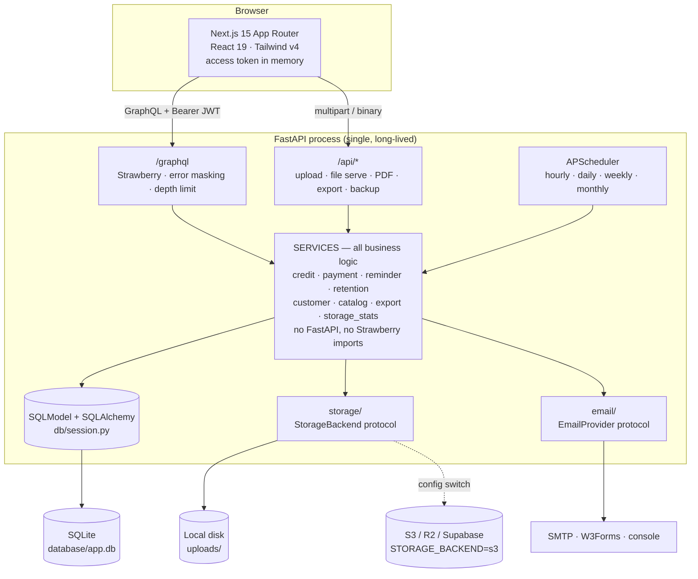
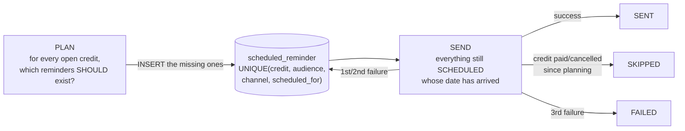
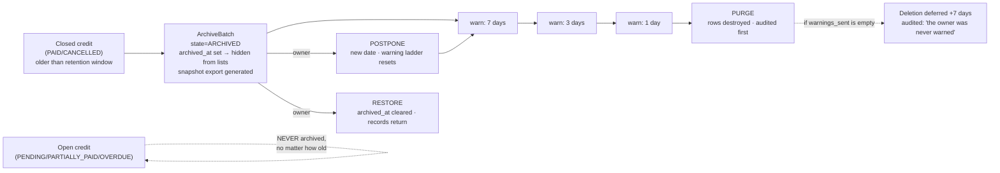

# Architecture

How the Credit Management System is built, and — more usefully — *why*, including
the trade-offs that were accepted and what each one costs.

The code is the source of truth. Where a module docstring already explains a
decision, this document points at it rather than paraphrasing it badly.

---

## 1. The shape of the thing

One repository, two deployables, one database.



Read the arrows into `SVC`: **GraphQL, REST and the scheduler are three callers of
the same services.** That is the single most important structural fact about this
codebase, and everything else in this document depends on it.

---

## 2. The layering rule

> Services hold all the business logic and import nothing from FastAPI or
> Strawberry.

This is not a style preference; it is enforced by the import graph and it buys
three concrete things.

**It makes the scheduler possible at all.** `app/scheduler/jobs.py` has no HTTP
request, no `Request` object, and nobody to raise an `HTTPException` at. It calls
`CreditService.promote_overdue()`, `ReminderService.plan_for_business()`,
`RetentionService.purge_due()` — the exact same methods a resolver calls. If the
business logic lived in resolvers, every automated job would need a duplicate
implementation, and the two would drift. The nightly reminder would eventually
compute a different balance than the dashboard.

**It makes the tests real.** `backend/tests/` constructs a `ServiceContext` and
calls services directly. There is no test client, no schema, no HTTP. The 22 tests
exercise the same code path production uses, minus the transport.

**It keeps the error contract in one place.** Services raise `AppError` subclasses
(`app/core/errors.py`). The GraphQL layer turns them into
`extensions.code`; `main.py`'s exception handler turns them into an HTTP status for
the REST routes. Neither translation lives in a service.

The seam is `ServiceContext` (`app/services/base.py`): session, actor, tenant,
request metadata, and one explicit `system: bool` flag. It is a dataclass — not a
FastAPI dependency, not a Strawberry `Info`.

```python
# app/graphql/context.py — from an HTTP request
ServiceContext(session=..., user=<User>, business_id=None, ip_address=..., user_agent=...)

# app/scheduler/jobs.py — from a cron trigger
ServiceContext(session=..., user=None, business_id=<one tenant>, system=True)
```

That `system=True` is deliberately an explicit flag rather than being inferred from
`user is None`. **An anonymous GraphQL request also has `user is None`.** Inferring
system identity from a missing user would hand every unauthenticated caller a
permission bypass. `app/graphql/context.py` never sets it, and there is no code path
from an HTTP request that can.

### Transactions

Services are the transaction boundary, but not uniformly, and the inconsistency is
on purpose:

- `AuthService.login()` **commits and then raises** on a bad password. The failed-attempt
  counter *is* the account lockout. A caller-owned transaction that rolled back on
  the exception would silently disable brute-force protection.
- `CreditService.create()` only **flushes**. The credit, its items, the customer
  aggregates and the audit row must land together or not at all.

Something has to close the transaction for the second kind. Copy-pasting
`session.commit()` into forty resolvers means the fortieth forgets, and a payment is
acknowledged to the shopkeeper and then discarded when the session closes. So
`app/graphql/mutations.py` wraps every mutation in a `@commits` decorator: the commit
happens after the resolver returns, and only if it returned. Committing an
already-committed session is a no-op, so applying it uniformly is safe — and uniform
is auditable.

---

## 3. Multi-tenancy

Every domain table carries an indexed `business_id` (`TenantEntity` in
`app/models/base.py`). A `Business` row is a tenant. Users belong to exactly one,
except `SUPER_ADMIN`, who belongs to none and may nominate any.

### `BaseService.scope_id` is THE security boundary

There is exactly one function in the codebase that answers "which business may this
caller touch", and every query in every service filters on its result:

| Caller | `scope_id` returns |
|---|---|
| `STAFF` / `ADMIN` | `user.business_id`, always |
| `STAFF` / `ADMIN` who *supplied* a different `business_id` | raises `PermissionDeniedError` |
| `SUPER_ADMIN` | `ctx.business_id` (must be supplied, else `ValidationError`) |
| Scheduler (`system=True`) | `ctx.business_id` (must be supplied, else `ValidationError`) |

Note the second row. A non-superadmin who passes someone else's `business_id` is
**rejected, not silently ignored**. A silent fallback would turn a probing client
into a quiet no-op instead of a logged failure, and would let a bug in the GraphQL
layer (passing an attacker-controlled id straight through) go unnoticed for years.

### `assert_in_scope` closes the get-by-id hole

`session.get(Credit, id)` bypasses every `WHERE` clause. A caller who guesses or
enumerates another tenant's UUID would read it. So every get-by-id path in every
service calls `assert_in_scope(row.business_id)` immediately after the fetch — or
uses `get_scoped()`, which does it for you.

### Why cross-tenant access raises NotFound, not Forbidden

```python
# app/services/base.py
def assert_in_scope(self, business_id: str | None) -> None:
    if business_id != self.scope_id:
        raise NotFoundError("Not found")
```

"That exists but isn't yours" **confirms the existence of another tenant's record.**
An attacker with a list of UUIDs and a `403`/`404` oracle can enumerate which ones
are real. `404` for both "does not exist" and "not yours" gives them nothing. The
same reasoning drives the login endpoint's single error message (§10).

The trade-off: a genuine permission bug in the frontend now looks like a missing
record, which is marginally harder to debug. The audit log carries the truth.

---

## 4. Money

Three representations, one value, and each boundary prevents a specific failure.

| Layer | Type | Failure it prevents |
|---|---|---|
| Database | `BigInteger` — minor units (cents) | SQLite has no true decimal. A `NUMERIC(14,2)` column with a fractional value is stored with **REAL affinity**, i.e. as a float. That is how a customer ends up owing `249.99999999999997`, and how balances drift after a few hundred partial payments. Integers are exact on SQLite *and* Postgres, so the migration stays lossless. |
| Python | `decimal.Decimal`, quantised to 2dp, `ROUND_HALF_UP` | Float arithmetic. `0.1 + 0.2 != 0.3`. Every sum in `CreditService` is Decimal. |
| GraphQL wire | `String` — `"1234.56"` | JSON numbers are **IEEE-754 doubles**. A client sending `1234567.89` hands the server `1234567.8899999999`, and the customer's balance is wrong by a cent forever. |

The conversion lives in `MoneyType` (`app/models/types.py`), a SQLAlchemy
`TypeDecorator`: `Decimal` in Python, `int` in the database. Nothing else in the
codebase multiplies by 100.

On the wire, `app/graphql/types.py::money()` always emits a 2dp string, and
`app/graphql/inputs.py::to_decimal()` parses one back — rejecting `NaN` and
`Infinity`, which `Decimal()` parses happily and which then poison every sum they
touch.

**The cost:** API consumers must not do arithmetic on money in JavaScript without
a decimal library. This is the single most important thing in [API.md](API.md).

---

## 5. Credits: five invariants and one function

`CreditService` (`app/services/credit.py`) owns these, and nothing else may write
the columns involved:

```
I1  grand_total   == subtotal - discount_amount + tax_amount
I2  amount_paid   == SUM(non-voided payments on this credit)
I3  remaining     == grand_total - amount_paid,  clamped at >= 0
I4  status        is a pure function of (remaining, paid, due_date, cancelled)
I5  customer aggregates and credit score reflect I2/I3 after every change
```

Every code path that touches money calls `recalculate()`, which restores all five
together and is idempotent by construction. **There is exactly one function that can
compute a total, so there is exactly one place a rounding bug can live.**

Two details worth knowing:

- **Tax applies after discount.** `taxable = line_subtotal - discount`, then
  `tax = taxable * pct / 100`. That is what tax authorities and customers expect.
- **Overpayment is clamped to `remaining = 0`, never stored negative.** A negative
  remaining would flow into the receivables total and quietly *understate* what every
  other customer owes. (Overpayment is also refused at the door — see §6 — so the
  clamp is belt-and-braces.)
- **`CANCELLED` is sticky.** It is the one status a human sets; every other status is
  derived.

### Why totals are stored, not computed

`amount_paid` and `remaining_amount` are columns, not views. This is a deliberate
denormalisation, and the reason is that the dashboard, the customer list, the overdue
filter and the nightly reminder sweep all need *"who still owes money"* as a
**filterable, sortable, indexable** value. Recomputing it with a correlated subquery
over `payment` on every row of every query does not survive contact with a real
dataset.

Same reasoning for `Customer.outstanding_balance` / `total_paid` / `credit_score`
and for `CreditStatus.OVERDUE` being a stored status promoted nightly rather than a
`WHERE due_date < today` computed on read.

**The safety net.** A denormalisation is only safe if something checks it. The
monthly job (`app/scheduler/jobs.py::monthly_maintenance`) calls
`CreditService.verify_integrity()`, which re-derives every credit's `amount_paid` and
`remaining_amount` **from the payment ledger**, reports any drift, corrects it, and
writes an `AuditLog` entry. If it ever finds drift, a write path bypassed
`recalculate()` and needs fixing — the report names the credit and the amount.

`test_integrity_check_detects_and_repairs_drift` proves the net catches a
deliberately corrupted row.

---

## 6. Payments: an append-only ledger

A payment is a claim about the physical world: a customer handed over Nu 500 in cash
on Tuesday. **Editing that row rewrites history.** If the amount was wrong, the truth
is not "it was always 300" — the truth is "we recorded 500, that was a mistake, and
here is the correction".

So `PaymentService` offers `record()` and `void()`. There is no `update()` and no
`delete()`. Voiding sets `voided_at` + a mandatory `void_reason`, then calls
`recalculate()`, which re-derives the balance from the surviving payments — so a
settled credit correctly reopens to `PENDING` / `PARTIALLY_PAID` / `OVERDUE` with no
special-casing.

`paymentHistory` returns voided payments too. The UI strikes them through rather than
hiding them; that is the entire point of an append-only ledger, and it is what a
shopkeeper arguing with a customer about a balance actually needs.

**Overpayment is refused at the counter**, not clamped downstream:

```
Payment of BTN 99999.00 is more than the BTN 1205.00 outstanding on CR-2026-0016.
Record 1205.00 to settle it in full.
```

The shopkeeper finds out while the customer is still standing there.

Two consequences fall out of the same principle:

- `cancelCredit` is refused once money has changed hands (void the payments first).
- `deleteCredit` is refused if any payment exists (cancel it instead, so the ledger
  survives).

`Payment.balance_after` is stored: the receipt must say what the balance actually was
at that moment, even if an earlier payment is voided later.

---

## 7. The reminder engine

This is the feature the product exists for, and it is the part most likely to be
built wrong.

### Materialised rows, not computed sends

A reminder is a `ScheduledReminder` row, planned in advance. The nightly work is
split into two independent steps:



**Idempotency is structural, not aspirational.** The unique constraint on
`(credit_id, audience, channel, scheduled_for)` makes a double-send *impossible* — not
unlikely. A server restart, a clock change, an overlapping worker, an admin hitting
"run now": none of them can duplicate a reminder, because planning cannot create a
duplicate row and sending consumes the row it finds.

`test_planning_is_idempotent` runs the plan twice and asserts the count does not move.

It also makes reminders **visible**: the owner can see what is queued for tomorrow
and cancel it. You cannot do that with a system that decides what to send at the
moment it sends it.

### Why the job runs hourly, not daily

Each business picks the hour it wants reminders sent (`reminder_send_hour`), **in its
own timezone**. A single daily cron at 08:00 UTC fires at 14:00 in Thimphu and 03:00
in Denver — the Bhutanese shop sends "due tomorrow" notices mid-afternoon, and the
Colorado one wakes its customers up.

So the job wakes every hour and asks each business: *"is it now your chosen hour,
where you are, and have I not already run for you today?"* Businesses whose hour it
isn't are skipped in microseconds. This handles every timezone and every DST
transition without a per-business cron entry.

The `_ran_today` guard is derived **from the data** (the most recent `SENT` reminder
for that business's local day), not from in-memory state — so a restart mid-sweep
cannot cause a second run.

### Who gets what

The spec requires reminding *both* owner and customer. These are different emails to
different people with different framing, so each is its own row with its own
`audience`:

- **Customer**: one polite notice about their own balance.
- **Owner**: a *single digest* per day — "these 4 credits are due" — batched from all
  the owner-audience rows. A shopkeeper with 40 credits due tomorrow needs one email,
  not forty.

Ordering matters in the job: `promote_overdue()` runs **first**, so a credit that fell
due today is already `OVERDUE` by the time the sweep picks a template. Otherwise the
customer gets a cheerful "due soon" note about a debt that is already late.

A customer with no email address is never queued (rather than queued and failed) —
`test_customer_without_an_email_is_never_queued`.

Failures stay `SCHEDULED` for two attempts (a transient SMTP blip retries tomorrow)
and only become `FAILED` on the third.

---

## 8. The retention pipeline

The spec's rule is *"nothing should be deleted immediately"*. The implementation's
rule is stronger: **data is never purged unless the owner was successfully warned.**



**The batch is the unit of consent.** Not a flag on each row — a batch. The owner
must be told *"312 records, 4.2 MB, deleting on the 30th"* **once**, not 312 times, and
"postpone" has to move all of it atomically. That is why `ArchiveBatch` is a table.

Details that matter:

- **Only closed records are ever archived.** An unpaid credit is never touched, no
  matter how old. Deleting a debt someone still owes you would be vandalism, not
  housekeeping. (`test_open_credits_are_never_archived`)
- **The eligibility date is `updated_at`, not `created_at`.** A credit opened a year
  ago and settled yesterday must not be archived the moment it settles.
- **`purge_due()` refuses to delete a batch with an empty `warnings_sent` list.** If
  the mail server was down for a week, that is *our* failure, not the owner's consent.
  It pushes the date out by `ARCHIVE_GRACE_DAYS` and audits the deferral.
  (`test_purge_refuses_when_the_owner_was_never_warned`)
- **The purge is audited *before* the rows are deleted** — once they are gone we
  cannot describe them.
- **Postponing resets the warning ladder** (`warnings_sent = []`), so the owner gets
  the full 7/3/1 series again before the new date. A postponement should not cost them
  their warnings.
- **A snapshot export is attached before the first warning is sent**, so the "Download"
  button in the warning email always points at something.
- `retention_policy = NEVER` skips the sweep entirely.
- The in-app notification fires **even if the warning email fails**. The owner must
  find out one way or another.

---

## 9. Storage

### The protocol

`app/storage/base.py` defines a `StorageBackend` Protocol — `write`, `read`, `delete`,
`exists`, `size`, `url_for`, `total_size`, `list_keys`. Two implementations: `LocalStorage`
(disk) and `S3Storage` (AWS S3 / Cloudflare R2 / Supabase Storage / MinIO).

A **storage key** is an opaque, backend-agnostic string:

```
businesses/<business_id>/<folder>/<xx>/<sha256>.webp
```

It works identically as a POSIX path and an S3 object key. `CreditService` never
imports `pathlib`. Moving to R2 is `STORAGE_BACKEND=s3` plus four env vars and
`pip install boto3` — no service, resolver or model changes.

The `<xx>` shard (first two hex chars of the checksum) exists because a business with
50k uploads would otherwise put 50k entries in one directory, which most filesystems
handle badly. 256 buckets keeps directories small.

The protocol is `async` even though `LocalStorage` could have been synchronous,
because `boto3` is blocking and every S3 call has to be pushed to a thread. **The
interface has to fit the slower backend, not the faster one.**

### Content-hash deduplication and reference counting

A file's identity is the SHA-256 of its **stored** bytes (post-compression — two phone
photos of the same receipt at different JPEG qualities may compress to identical WebP,
and if they do, they *are* the same file).

- `UNIQUE(business_id, checksum)` — re-uploading a file this business already has
  returns the existing `FileAsset` and writes nothing to disk.
- Dedup is **per-business, not global**, on purpose. Cross-tenant dedup would let one
  business's storage bill depend on another's, and would let a file survive after its
  only owner deleted it — a privacy problem dressed up as a saving.
- `reference_count` tracks how many domain rows point at an asset. `attach()` /
  `detach()` are the only way to move it. Without this, deleting one of two credits
  that share a photo would delete the photo out from under the other.
- When the count hits zero, `orphaned_at` starts a **24-hour grace clock**. The nightly
  sweep only deletes assets that have been unreferenced past it — because the UI's
  "replace photo" flow detaches then re-attaches, and a user may abandon a half-filled
  form.

### The image pipeline

`app/storage/images.py`, on every image upload:

1. Apply the EXIF orientation tag, **then** strip EXIF (also a privacy win — phone
   photos carry GPS coordinates).
2. Downscale the long edge to `IMAGE_MAX_DIMENSION` (1600px).
3. Re-encode as WebP at `IMAGE_QUALITY` (82), `method=6`.
4. Emit a 320px thumbnail for list/grid views.

Typical result: **4.2 MB → ~180 KB, a ~95% saving.** A customer table with 50 rows
downloads ~200 KB of thumbnails instead of ~150 MB of originals.

Guard rails: `Image.MAX_IMAGE_PIXELS = 50_000_000` (a 10 KB PNG can declare
50000×50000 pixels and OOM the process on decode); a file that would come out *bigger*
as WebP is stored as-is; a corrupt image is stored unchanged rather than lost; Pillow
runs in `asyncio.to_thread` so a 6 MB decode does not stall the event loop.

Non-images (PDF invoices) pass through untouched. **Generated PDFs are never stored** —
invoices and receipts are rendered on demand and streamed (spec requirement), and
exports self-destruct after `EXPORT_TTL_HOURS`.

---

## 10. Email

One `EmailProvider` Protocol, three implementations, and one capability flag that
carries the entire honesty of the system:

| Provider | `can_send_to_arbitrary_recipients` | Reaches the owner | Reaches a customer |
|---|---|---|---|
| `w3forms` | **False** | yes | **no — impossible** |
| `smtp` | True | yes | yes |
| `console` | True | logs it | logs it |

**W3Forms is a form-to-email relay, not a mail transport.** You register an inbox, you
get an access key, and every submission carrying that key is delivered *to that inbox*.
The API has no recipient parameter. There is no way — none — to make it email a
customer. That is what the free tier *is*; it is not a bug to work around.

The tempting fix, when the configured provider cannot reach the intended recipient, is
to send it *somewhere* (to the owner, say) and return success. **That is the worst
possible behaviour**: the reminder never reaches the customer, the credit goes unpaid,
and the system reports that it did its job.

So `EmailService._dispatch()` checks the flag **before** dispatch. A customer-bound
message on a relay-only provider produces:

- an `EmailLog` row with `success = False` and an error naming both the cause *and*
  the cure ("set `EMAIL_PROVIDER=smtp`"),
- a `ScheduledReminder` marked `FAILED`,
- an entry in the owner's notification centre.

**You will never be told a customer was reminded when they weren't.**

Callers that *know* they are mailing the owner (the reminder digest, the deletion
warning) pass `owner_recipient=True` explicitly rather than letting the service guess
from the address. Every send — success, provider rejection, capability refusal, or an
unexpected exception inside a provider — writes an `EmailLog` row. A path that skips
the log is a bug.

Templates live in the database (`EmailTemplate`), per business, editable from the
admin panel. Rendering uses a deliberately tiny `{{variable}}` substitution engine
**and not Jinja**: these are user-authored strings from the DB, and handing those to
Jinja gives you server-side template injection (`{{ ''.__class__.__mro__ }}` → arbitrary
object access). A whitelist substitution can only ever emit values we chose to expose,
and every value is HTML-escaped on the way in.

`ReminderChannel` already declares `SMS` and `WHATSAPP`. Adding them is a new class
implementing the same Protocol — not a schema change. That is what "future-ready" has
to mean to be worth anything.

---

## 11. Security

### Passwords

**bcrypt, called directly, with a SHA-256 pre-hash.**

*Why not passlib:* it has been unmaintained since 2020, and its bcrypt backend probes
the driver at import time with a >72-byte password. bcrypt 4.1+ *raises* on that
instead of truncating, so `import passlib` now dies with `password cannot be longer
than 72 bytes` before any application code runs.

*Why the pre-hash:* bcrypt ignores everything past byte 72. Without a pre-hash, two
different long passphrases sharing a 72-byte prefix are the **same password**, and a
user who pastes a 100-character generated secret has 28 characters silently thrown
away. `base64(sha256(password))` is 44 bytes — comfortably under the ceiling. Base64
rather than the raw digest because bcrypt truncates at the first NUL byte, which a raw
digest can contain.

Cost factor 12 (~250 ms/hash).

### Tokens

| Token | Lifetime | Storage |
|---|---|---|
| Access (JWT, HS256) | 30 min (`ACCESS_TOKEN_EXPIRE_MINUTES`) | stateless; frontend keeps it **in memory only** |
| Refresh (JWT) | 30 days | a **SHA-256 digest** is persisted in `refresh_token`; frontend keeps the raw token in `localStorage` |
| Password reset | 60 min | digest persisted; single-use |

JWTs are stateless and cannot be un-issued, so a stolen refresh token would be valid
until it expired. Persisting a **digest** gives real revocation (logout, password
change, admin kill) while a database leak still yields nothing replayable.

**Rotation:** `refreshToken` revokes the presented token and issues a brand-new pair. A
stolen refresh token is usable at most once, and the legitimate user's next refresh
then fails — a detectable event.

A password reset or change **revokes every live refresh token**. Resetting a password
is what you do when you believe you are compromised; leaving the attacker's session
alive would make the reset theatre.

### Roles → permissions

An explicit matrix in `app/core/security.py`, not scattered `if user.role == "admin"`
checks. Resolvers call `service.require(Permission.CREDIT_DELETE)` and never reason
about roles, so adding an "Accountant" role touches exactly one file.

| | STAFF | ADMIN | SUPER_ADMIN |
|---|:---:|:---:|:---:|
| read business / customers / catalog / credits / payments / reports / settings / storage | ✅ | ✅ | ✅ |
| write customers, credits, payments | ✅ | ✅ | ✅ |
| write catalog, settings, templates; send reminders; create exports | ❌ | ✅ | ✅ |
| delete customers / credits / payments; manage users | ❌ | ✅ | ✅ |
| storage maintenance, retention management, audit log | ❌ | ✅ | ✅ |
| create/delete businesses, cross-tenant access | ❌ | ❌ | ✅ |

`ADMIN` = every `STAFF` permission plus the destructive and configuration ones.
`SUPER_ADMIN` = the whole enum.

### Login

- **Account lockout**: 5 failed attempts → locked 15 minutes.
- **No user enumeration**: "unknown email" and "wrong password" produce the *identical*
  message, and the unknown-email path still runs a full bcrypt verify against a dummy
  hash. Skipping that verify would make a miss return in ~0.1 ms and a hit in ~250 ms,
  which is an oracle: an attacker could harvest your customer list by timing the login
  endpoint.
- `requestPasswordReset` reports the same thing for a registered address and an
  unknown one, for the same reason.

### GraphQL

**Error masking** (`MaskedSchema.process_errors`). GraphQL's default is to put
`str(exception)` in the response. That is a disclosure vulnerability the moment the
exception is not one we wrote:

```
IntegrityError: UNIQUE constraint failed: user.email
[SQL: INSERT INTO user (id, email, hashed_password, ...) VALUES (?, ?, ?, ...)]
```

— table names, column names, the ORM, and confirmation that an account exists. So
exactly two things can leave the schema:

- an `AppError` — raised on purpose, message written for a human, surfaced verbatim with
  `extensions.code`;
- **anything else** — logged server-side with the full traceback, returned to the client
  as the single string `"Internal server error"` and `code: INTERNAL_SERVER_ERROR`, with
  `original_error` scrubbed off the payload.

The discriminator is `isinstance(original, AppError)` — not a message pattern, not a
status code. An exception is either one we anticipated or one we did not, and only the
first kind is safe to describe.

**Query depth limit** of 12. Today's schema is acyclic (the deepest legitimate query is
about 3), so this costs no legitimate client anything. It is there so that the day
someone adds `CustomerType.credits` — which closes a `credit → customer → credit` cycle —
the DoS does not ship with it.

**Introspection is off in production.** Worth knowing *why it has to be a separate
control*: Strawberry's `QueryDepthLimiter` does **not** limit introspection.
`determine_depth` returns 0 for any field starting with `__`, so the classic
introspection bomb (`{ __schema { types { fields { type { ofType { ... ×20 }}}}}}`) is
**not** caught by `max_depth` at any setting (verified against strawberry 0.321). The
mitigation is the right one anyway: production simply does not answer introspection,
and GraphiQL is not served (`main.py`). Development keeps both on.

### Other

- **Path-traversal guard**: `LocalStorage._resolve()` resolves the candidate path and
  asserts it is still inside the upload root. Without it, a key of `../../etc/passwd`
  would let a caller read or clobber anything the process can reach.
- **Sort injection**: every `sort_by` is an allow-listed column lookup, never
  `getattr(Model, client_string)`.
- **Export tenancy**: an export is the one operation that hands a large slice of the
  database to a human as a file. A missing `business_id` filter there ships another
  shop's customer list to a stranger. Every dataset builder in `export.py` writes the
  `business_id ==` predicate out explicitly — there is no shared base-query helper a
  future dataset could forget to call.
- **Production boot check**: `Settings.assert_production_ready()` refuses to start with
  the placeholder `SECRET_KEY`, with `DEBUG=true`, or with `EMAIL_PROVIDER=console`.

---

## 12. The data model

```mermaid
erDiagram
    BUSINESS ||--o{ USER : "employs"
    BUSINESS ||--o{ CUSTOMER : "owns"
    BUSINESS ||--o{ CREDIT : "owns"
    BUSINESS ||--o{ PAYMENT : "owns"
    BUSINESS ||--o{ PRODUCT : "owns"
    BUSINESS ||--o{ SERVICE : "owns"
    BUSINESS ||--o{ CATEGORY : "owns"
    BUSINESS ||--o{ FILE_ASSET : "owns"
    BUSINESS ||--o{ EMAIL_TEMPLATE : "owns"
    BUSINESS ||--o{ NOTIFICATION : "owns"
    BUSINESS ||--o{ ARCHIVE_BATCH : "owns"
    BUSINESS ||--o{ AUDIT_LOG : "owns"

    USER ||--o{ REFRESH_TOKEN : "holds"
    USER ||--o{ PASSWORD_RESET_TOKEN : "holds"

    CUSTOMER ||--o{ CREDIT : "takes"
    CREDIT ||--|{ CREDIT_ITEM : "has lines"
    CREDIT ||--o{ PAYMENT : "is settled by"
    CREDIT ||--o{ SCHEDULED_REMINDER : "triggers"

    CATEGORY ||--o{ PRODUCT : "groups"
    CATEGORY ||--o{ SERVICE : "groups"
    PRODUCT ||--o{ CREDIT_ITEM : "snapshotted into"
    SERVICE ||--o{ CREDIT_ITEM : "snapshotted into"

    ARCHIVE_BATCH ||--o{ CREDIT : "archives"
    ARCHIVE_BATCH ||--o{ PAYMENT : "archives"
    ARCHIVE_BATCH ||--o| EXPORT_JOB : "snapshot"

    FILE_ASSET ||--o{ EXPORT_JOB : "holds bytes for"

    BUSINESS {
        str id PK
        str name
        str slug UK
        str currency
        str timezone "IANA — reminders fire in local time"
        json reminder_days_before "default [7,3,1]"
        int reminder_send_hour "business-local"
        enum reminder_audience "CUSTOMER|OWNER|BOTH"
        enum retention_policy "DAYS_30|60|90|NEVER"
        int storage_quota_mb "soft cap: warns, never blocks"
    }
    USER {
        str id PK
        str email UK
        str hashed_password "bcrypt(base64(sha256(pw)))"
        enum role "SUPER_ADMIN|ADMIN|STAFF"
        str business_id FK "NULL only for SUPER_ADMIN"
        int failed_login_attempts
        datetime locked_until
    }
    CUSTOMER {
        str id PK
        str code UK "unique per business — CUST-0007"
        str name
        str email "NULL ⇒ can never be emailed a reminder"
        enum status "ACTIVE|INACTIVE|BLOCKED|DEFAULTED"
        int credit_score "0-100, explainable, recomputed on payment"
        money outstanding_balance "DENORMALISED — see §5"
        money total_credit "DENORMALISED"
        money total_paid "DENORMALISED"
    }
    CREDIT {
        str id PK
        str number UK "unique per business — CR-2026-0042"
        str customer_id FK
        money subtotal
        money discount_amount
        money tax_amount
        money grand_total "I1"
        money amount_paid "I2 — STORED, from the ledger"
        money remaining_amount "I3 — STORED, clamped >= 0"
        enum status "I4 — derived, never hand-set (except CANCELLED)"
        date due_date
        date reminder_date "override; NULL ⇒ use business defaults"
        datetime archived_at "non-NULL ⇒ in the deletion pipeline"
        str archive_batch_id FK
    }
    CREDIT_ITEM {
        str id PK
        str credit_id FK
        str name "SNAPSHOT — last month's price must not move"
        money unit_price "SNAPSHOT"
        decimal quantity
        money discount_amount
        decimal tax_percentage "applied AFTER discount"
        money line_total
    }
    PAYMENT {
        str id PK
        str number UK "PAY-2026-0117"
        str credit_id FK
        money amount
        money balance_after "snapshot — what the receipt said"
        enum method "CASH|BANK_TRANSFER|CARD|MOBILE_MONEY|CHEQUE|OTHER"
        datetime voided_at "VOID, never edit or delete"
        str void_reason "mandatory"
    }
    SCHEDULED_REMINDER {
        str id PK
        str credit_id FK
        enum audience
        enum channel "EMAIL (SMS/WHATSAPP declared)"
        date scheduled_for
        enum status "SCHEDULED|SENT|FAILED|SKIPPED|CANCELLED"
        int attempts "FAILED only on the 3rd"
    }
    FILE_ASSET {
        str id PK
        str checksum "sha256 of STORED bytes — UNIQUE per business"
        str storage_key UK "backend-agnostic; also an S3 key"
        str thumbnail_key
        int size_bytes
        int original_size_bytes "powers 'you saved X MB'"
        int reference_count "0 ⇒ orphan clock starts"
        datetime orphaned_at "swept after 24h grace"
        datetime expires_at "exports self-destruct"
    }
    ARCHIVE_BATCH {
        str id PK
        enum state "ARCHIVED|POSTPONED|PENDING_DELETION|RESTORED|DELETED"
        int record_count
        datetime delete_scheduled_for
        json warnings_sent "[7,3,1] — empty ⇒ purge REFUSED"
        str export_id "the download the owner was promised"
    }
    EXPORT_JOB {
        str id PK
        enum format "CSV|XLSX|JSON|PDF"
        enum state "PENDING|RUNNING|READY|FAILED|EXPIRED"
        datetime expires_at "EXPORT_TTL_HOURS (24h)"
    }
    AUDIT_LOG {
        str id PK
        enum action "CREATE|UPDATE|DELETE|PURGE|LOGIN|..."
        str entity_type
        str entity_id
        json changes "a DIFF, never a row snapshot"
        str actor_label "'scheduler' for automated jobs"
    }
```



Cross-cutting conventions:

- **UUID primary keys**, stored as 32-char hex. Sequential integers leak business
  volume ("customer #4") and collide when merging SQLite files during a cloud
  migration. Hex strings behave identically on SQLite and Postgres.
- **Soft delete everywhere** (`deleted_at`). Nothing is destroyed immediately; the
  retention pipeline is the only thing that hard-deletes.
- **Enums stored as strings.** A human reading the SQLite file or a CSV export should
  see `PARTIALLY_PAID`, not `2`.
- **Everything is UTC in the database.** The business's timezone is applied at the
  display/reporting edge. Mixing local times in the DB is the classic source of "the
  reminder fired a day late".
- **`CreditItem.name` and `unit_price` are snapshots, and that is not a normalisation
  failure.** If the shop raises the price of rice next month, last month's credit must
  still say what the customer actually agreed to owe. Historical documents are
  immutable; live catalog rows are not. It is the one place copying is correct.

---

## 13. Why binaries are REST and not GraphQL

GraphQL speaks JSON. Pushing a 6 MB photo through it means base64 — a 33% size tax
plus the whole thing buffered in memory as a string. Pulling a PDF back out means the
browser cannot just follow a link: it has to fetch JSON, decode, build a Blob and
synthesise a download.

So binaries move over REST (multipart in, streamed bytes out) and GraphQL carries the
**identifiers**. Upload returns a file id; you attach that id to a credit with a
GraphQL mutation. See [API.md §7](API.md).

---

## 14. The scheduler, and what it costs

An in-process `AsyncIOScheduler` living inside the API process. It is the right call
for this product's constraints — zero extra infrastructure, zero extra cost, works on
a $5 VPS or a Raspberry Pi in the back of the shop — and it is what makes free hosting
viable at all.

The trade-offs, stated plainly:

- **Two API instances = two schedulers.** Both wake up, both run the jobs. The jobs are
  idempotent, so this is not a correctness disaster — but it is wasted work, and
  duplicate emails are possible in the race window between two workers reading the same
  `SCHEDULED` row. **Run one instance**, or set `SCHEDULER_ENABLED=false` on all but one.
- **On serverless there is no long-lived process, so the scheduler never fires at all.**
  This is the single reason the backend must not go on Vercel. See
  [DEPLOYMENT.md](DEPLOYMENT.md).

The migration path when you outgrow it: swap `MemoryJobStore` for `SQLAlchemyJobStore`
(the database becomes the lock), or move the jobs to a real queue (Celery / Dramatiq /
ARQ). **Nothing in `jobs.py` changes** — they are plain async functions with no
APScheduler dependency, deliberately.

| Job | Schedule | Does |
|---|---|---|
| `reminder_sweep` | hourly, on the hour | promote overdue → plan → send, per business at its own local hour |
| `daily_maintenance` | 02:30 | temp files, expired exports, orphan sweep; then archive → warn → purge |
| `weekly_maintenance` | Sun 03:30 | `ANALYZE`, `PRAGMA optimize`, WAL checkpoint, trim logs >90d, then `VACUUM` on its own connection |
| `monthly_maintenance` | 1st, 04:30 | `PRAGMA integrity_check` + re-derive every credit's balance from the ledger |

`VACUUM` runs *outside* any transaction, on its own `AUTOCOMMIT` connection — SQLite
refuses to vacuum inside one, and SQLAlchemy opens one implicitly on the first
statement of any session. Similarly, the database backup uses SQLite's **online backup
API** (`sqlite3.Connection.backup()`), not `shutil.copy`: copying the file while the
app is running gives you a *torn* copy that will often open fine and then fail an
integrity check — the worst kind of backup, the one you discover is broken on the day
you need it.

---

## 15. The frontend

Next.js 15 App Router, React 19, TypeScript, Tailwind v4.

```
src/
├── app/
│   ├── (auth)/         login · register · forgot-password · reset-password
│   ├── (dashboard)/    dashboard · credits · customers · payments · products
│   │                   services · reports · notifications · settings/*
│   └── (public)/       terms · privacy
├── components/
│   ├── ui/             25 primitives — button, dialog, table, toast, …
│   ├── layout/         dashboard shell, sidebar, topbar, command palette, notification bell
│   └── auth/           auth card, password input, strength meter
├── features/           one folder per domain: components · hooks · queries
│   ├── dashboard/  credits/  payments/  customers/  catalog/
│   └── reports/    settings/  notifications/  search/
├── hooks/              use-disclosure, use-focus-trap, use-hotkey, use-roving-focus, …
├── lib/
│   ├── auth/           AuthProvider, tokens, permissions, queries
│   ├── graphql/        client.ts — the transport
│   └── validation/     Zod schemas
└── middleware.ts       route guard (UX, not security)
```

**Why `features/` and not one giant `components/`:** a credit-list column definition
is only ever used by the credit list. Filing it next to the button component buys
nothing and costs you the ability to find it. Each feature folder owns its own
queries, so the GraphQL document for the dashboard lives beside the thing that
renders it — and deleting a feature is deleting one folder.

**Design tokens** live in `src/app/globals.css`, not in a JS config — Tailwind v4 is
CSS-first and does not read a theme block from `tailwind.config.ts`. Every
text/background pair is contrast-checked against WCAG 2.1 with the measured ratio in a
comment; body text ≥ 4.5:1, non-text UI ≥ 3:1. Dark mode is a **class**
(`next-themes` with `attribute="class"`), not a media query — the user's explicit
choice must beat the OS preference.

**Auth flow** (`lib/auth/tokens.ts`, `lib/graphql/client.ts`):

- The **access token lives in a module variable — memory only.** An XSS payload cannot
  read it out of storage; it would have to execute inside our bundle's scope during a
  live session.
- The **refresh token is in `localStorage`**, because the backend does not yet set
  httpOnly cookies and it has to survive a reload. *This is the weak link and it is
  acknowledged as such in the source.* Mitigation: the backend stores only a digest and
  supports revocation, so a stolen token can be killed. The intended hardening (backend
  sets `HttpOnly; Secure; SameSite=Strict`, client sends `credentials: "include"`) is
  written up in the file's docstring.
- On a 401, **one shared in-flight refresh promise** serves every waiter. Five queries
  mounting at once would otherwise fire five refreshes, four of which race and — against
  a *rotating* refresh-token backend — invalidate each other.
- `middleware.ts` reads a non-httpOnly `cms_session` marker cookie that carries **no
  token**. It is a UX guard that stops a logged-out visitor seeing a dashboard skeleton;
  forging it gets you an empty shell and a wall of 401s. The API is the only thing that
  authorises anything.

---

## 16. What the tests actually guarantee

22 tests, all passing, `backend/tests/`. They cover the two things that hurt most when
they break — not coverage percentage.

**`test_credit_money.py` (11)** — line totals; tax-after-discount; partial payments moving
status and balance; overpayment refused; void restoring the balance *and reopening* the
credit; **no float drift over many partial payments**; customer aggregates following the
money; overdue promotion; delete refused when payments exist; discount larger than the
line rejected; and the integrity checker detecting *and repairing* deliberately
corrupted balances.

**`test_reminders_and_retention.py` (11)** — a reminder planned per configured offset;
**planning twice is a no-op**; only what is due today is sent; a credit paid since
planning is `SKIPPED`, not sent; a customer with no email is never queued; **open credits
are never archived**; closed credits past the window are archived *not deleted*; **purge
refuses when the owner was never warned**; purge after warning deletes *and* audits;
postpone and restore; and `NEVER` archiving nothing.

Not covered by tests: the GraphQL layer itself, the storage backends, the email
providers, the frontend.

---

## 17. Known limitations, and what I would do next

Honest list. Nothing here is hidden in a footnote.

| Limitation | Impact | The fix |
|---|---|---|
| **Single-instance scheduler.** Two API replicas = two schedulers = duplicate work and possible duplicate emails. | Cannot scale the API horizontally without care. | `SCHEDULER_ENABLED=false` on all but one instance today; `SQLAlchemyJobStore` or a real queue tomorrow. `jobs.py` does not change. |
| **Offset pagination** (`page`/`limit`). `OFFSET` makes the database walk and discard skipped rows, so page 5000 is slower than page 1. | Bounded: `MAX_PAGE_SIZE=100`, every query is `business_id`-filtered first, and the composite indexes cover the sort keys the UI offers. Fine for a shop with thousands of credits. | Keyset/cursor pagination. The `Page` shape already leaves room for it without changing the GraphQL contract. |
| **File serving on local storage is unauthenticated.** `/api/files/{key}` has no auth dependency. | The key contains a SHA-256 of the contents, so a URL is an unguessable **capability** — you cannot enumerate other tenants' files. What you do *not* get is **revocation**: anyone handed the URL keeps access. | `STORAGE_BACKEND=s3` (then `url_for()` issues short-lived signed URLs), or put an auth dependency on the route and have the frontend fetch images with the bearer token. |
| **W3Forms cannot reach customers.** | With `EMAIL_PROVIDER=w3forms`, *every customer reminder fails* — loudly, visibly, by design. Owner mail works. | `EMAIL_PROVIDER=smtp` + four env vars. Brevo (300/day), Resend (3k/mo) and Gmail all have free tiers. Nothing else changes. |
| **Refresh token in `localStorage`.** | XSS can read it and mint access tokens until it expires or is revoked. | Backend sets an httpOnly refresh cookie; client stops touching storage. The plan is in `tokens.ts`. |
| **`init_db()` still runs on boot.** Alembic is set up (`alembic.ini`, `migrations/`, an initial revision) and owns schema changes, but `main.py` also calls `SQLModel.metadata.create_all()` at startup. `create_all` only ever *creates missing* tables — it cannot alter an existing one — so the two do not fight. It is belt-and-braces, not a second source of truth. | None today. It would become confusing if someone mistook it for a migration path. | Drop the `init_db()` call once you are running `alembic upgrade head` on deploy. |
| **SQLite is a single-writer database.** | With WAL + `busy_timeout=30000` this handles a shop comfortably. It will not handle a hundred concurrent tenants writing. | `DATABASE_URL=postgresql+psycopg://…`. The pooling branch in `db/session.py` is already written and inert on SQLite. |
| **Reports/exports run synchronously in the request.** A large XLSX export blocks its worker while it builds. | Acceptable at shop scale. | Move `ExportService` behind a job queue and let `ExportJob.state` do what it was designed for (`PENDING → RUNNING → READY`). |
| **Credit numbering uses `MAX(...)+1`.** | Safe on SQLite (writes are serialised). On Postgres the `UNIQUE(business_id, number)` constraint is the real guarantee — a racing duplicate fails the insert. | A retry-on-conflict wrapper, or a per-tenant sequence. |
| **No rate limiting on login.** Account lockout after 5 attempts is the only brute-force defence; there is no IP-level throttle. | A distributed attack across many accounts is not slowed. | A reverse-proxy rate limit, or `slowapi`. |

---

## Where to read next

| | |
|---|---|
| [INSTALLATION.md](INSTALLATION.md) | Setup, the full environment-variable reference, troubleshooting |
| [DEPLOYMENT.md](DEPLOYMENT.md) | Going live — and why the backend must not go on Vercel |
| [API.md](API.md) | The GraphQL schema, with verified copy-pasteable examples |
